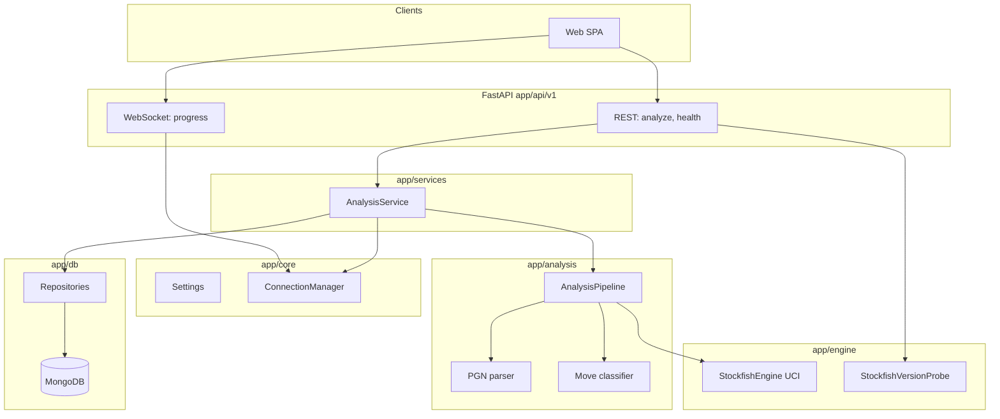

# ChessEval Backend

FastAPI service for chess game and position analysis: PGN parsing, Stockfish UCI evaluation, move classification, MongoDB persistence, and WebSocket progress for long-running PGN jobs.

## Architecture

ChessEval backend is layered so HTTP/WebSocket stay thin, orchestration lives in services, and engine/parse logic stays testable in isolation.



**Request paths (what happens today)**

| Path | Role |
|------|------|
| `GET /api/v1/chesscom/player/{username}/recent-games` | Query `limit` (default 10, max 31): proxy to Chess.com **Published Data API** for recent standard games with PGN (newest first). After assembling the game list, the server fetches **`GET https://api.chess.com/pub/player/{username}`** once per distinct player in that list (small delay between calls) and returns **`player_profiles`** keyed by lowercase username (`name`, `title`, `avatar`). Each game item also includes optional **`white_display_name`**, **`white_title`**, **`black_display_name`**, **`black_title`** when the profile call succeeded. Requires outbound HTTPS from the server to `api.chess.com`. |
| `POST /api/v1/analyze/pgn` | Validates PGN, creates a `processing` document in MongoDB, starts a **background** full-game analysis, returns `analysis_id` + initial payload. Engine depth comes from **`STOCKFISH_DEPTH`** in the environment (request `depth` / `movetime` fields are deprecated and ignored). |
| `WebSocket /api/v1/ws/analysis/{analysis_id}` | Client subscribes; server pushes `progress` (move index, percentage, optional `last_move`), then `completed` with the full analysis or `failed`. Payloads are JSON-serialized with `jsonable_encoder` so datetimes in results do not break the socket. |
| `POST /api/v1/analyze/fen` | Synchronous single-position analysis (eval, best move, multi-PV lines); may write **position cache** in MongoDB. Same server-controlled depth. |
| `GET /api/v1/health` | Liveness: Mongo ping, Stockfish binary presence, and **`stockfish_version`** (UCI `id name`, e.g. Stockfish 18) via a short subprocess probe. |
| `GET /api/v1/analysis/{id}` / `GET /api/v1/analyses` | Read stored analyses. |

**Engine behavior**

- **`StockfishEngine`** runs the binary over UCI (`asyncio` subprocess). Per-position analysis uses **`go depth N`** when **`STOCKFISH_MOVETIME=0`** (default), so searches are depth-limited only, not cut off by a movetime cap. If `STOCKFISH_MOVETIME > 0`, the command adds `movetime` as an additional ceiling.
- **White POV**: raw UCI scores are from the side to move. **`WhitePovEngineNormalizer`** (`app/engine/white_pov.py`) flips centipawn and mate scores when Black is to move so API consumers and **`MoveClassifier`** always see evaluations from White’s perspective (positive favors White). Cached positions may carry **`eval_white_pov`**; older cache rows are normalized on read when that flag is absent. Run **`scripts/normalize_cache_white_pov.py`** once, then optionally set **`CACHE_STRICT_WHITE_POV=true`** to skip that legacy read-time flip (see `.env.example`).
- **`AnalysisPipeline`** replays the game, evaluates before/after positions, derives centipawn loss, and assigns classifications (brilliant / best / blunder / book / etc.).

## Prerequisites

- **Python 3.10+**
- **MongoDB** (local or Atlas)
- **Stockfish** binary ([stockfishchess.org](https://stockfishchess.org/download/)) — e.g. Stockfish 18
- **Outbound HTTPS** if you use **Chess.com profile import** (`GET /api/v1/chesscom/...`) so the server can reach `api.chess.com`

## Environment setup

### 1. Virtual environment

```bash
cd backend
python3 -m venv venv
source venv/bin/activate
```

On Windows: `.\venv\Scripts\activate`

### 2. Install dependencies

```bash
pip install -r requirements.txt
```

### 3. Configuration

```bash
cp .env.example .env
```

Edit `.env`. **`STOCKFISH_PATH`** must be an absolute path to your binary.

- **`STOCKFISH_DEPTH`**: search depth per position (capped by `MAX_ANALYSIS_DEPTH` in `app/core/config.py`, default 245).
- **`STOCKFISH_MOVETIME`**: `0` = depth-only (`go depth N`). Set a positive value only if you want a time cap as well.

The engine’s marketing version string comes from UCI `id name` (exposed as `stockfish_version` on `GET /api/v1/health`). The shell flag `stockfish --version` is **not** UCI; Stockfish may print a line then `Unknown command`. To inspect from the CLI:

```bash
echo -e "uci\nquit" | /path/to/stockfish | grep "id name"
```

Example `.env` fragment:

```ini
MONGODB_URL=mongodb://localhost:27017
MONGODB_DB_NAME=chess_eval
STOCKFISH_PATH=/opt/homebrew/bin/stockfish
STOCKFISH_DEPTH=64
STOCKFISH_MOVETIME=0
STOCKFISH_THREADS=2
STOCKFISH_HASH_MB=256
```

## Run the API

```bash
uvicorn app.main:app --reload --port 8888
```

- API base: `http://localhost:8888`
- OpenAPI: `http://localhost:8888/docs`

## Project layout

| Path | Purpose |
|------|---------|
| `app/main.py` | FastAPI factory, CORS, lifespan (Mongo connect), exception handlers |
| `app/api/v1/` | Routers: `analysis`, `chesscom`, `health`, `websocket` |
| `app/services/analysis_service.py` | Orchestrates PGN jobs, FEN analysis, DB updates, WS broadcasts |
| `app/api/v1/chesscom.py` | Chess.com archive proxy (recent games + PGN) |
| `app/services/chess_com_archive_client.py` | httpx client: Chess.com game archives + **`pub/player`** profile fan-out for titles / names / avatars |
| `app/analysis/pipeline.py` | Move-by-move engine loop and summaries |
| `app/analysis/pgn_parser.py` / `classifier.py` | Parse games and label moves |
| `app/engine/stockfish.py` | UCI session and `go` limits; returns White-POV-normalized results |
| `app/engine/white_pov.py` | Normalize engine evals to White’s perspective |
| `app/engine/stockfish_probe.py` | Short UCI handshake for version string |
| `app/core/config.py` | `pydantic-settings` from `.env` |
| `app/core/websocket.py` | Room-per-`analysis_id` broadcast helper |
| `app/db/` | Motor client + repositories |
| `app/schemas/` | Pydantic request/response models (including **`chesscom`** game list + **`ChessComPlayerBrief`**) |
| `app/models/` | Domain / Mongo document shapes |

Docker: `Dockerfile` installs the distro `stockfish` package and sets `STOCKFISH_PATH` for container runs.
