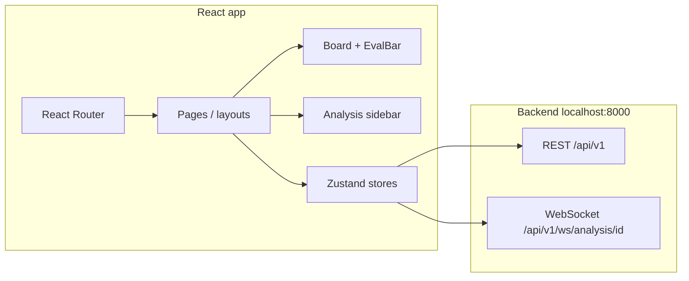

# ChessEval Frontend

Vite + React + TypeScript SPA for submitting games or FEN positions, watching async PGN analysis, and exploring results on an interactive board with eval bar, move list, engine lines, summary, and eval chart.

## Architecture

The UI is a client-only app that talks to the **ChessEval backend** over HTTP and (for PGN jobs) **WebSocket**. State is split by concern: server-backed analysis in Zustand + TanStack Query, board replay in a dedicated game store, and lightweight UI chrome (tabs) in a small UI store.



**What the app does today**

1. **Setup** (`SetupView`): user pastes **PGN** or **FEN**. PGN submit kicks off `POST /api/v1/analyze/pgn`, stores `analysis_id`, loads the PGN into **`gameStore`** for move replay, and opens a **WebSocket** to receive `progress` / `completed` / `failed`. FEN submit uses `POST /api/v1/analyze/fen` and shows a single-position result.
2. **Analysis page**: chessboard (`react-chessboard` + `chess.js` FEN history), **eval bar** tied to the selected move’s engine eval, **board controls** (first/prev/next/last + keyboard) synced with **`selectedMoveIndex`**, sidebar tabs (**Moves** list with classifications, **Engine** lines for the current position when applicable, **Summary**), and **eval graph** (Chart.js) for the whole game.
3. **Progress overlay**: while a PGN job is running, a modal shows engine progress; it clears when the WebSocket delivers `completed` with the full result.
4. **Styling**: Tailwind CSS v4 with design tokens in `src/index.css` (dark “Linear-style” theme).

**Integration notes**

- Vite **`/api` proxy** (see `vite.config.ts`) forwards REST calls to the backend so the browser can use same-origin `/api/...` in dev.
- The WebSocket client currently targets **`ws://localhost:8000`** for analysis progress; align this with your deployment host or tunnel when not developing locally.

## Tech stack

- **React** 19, **Vite** 8, **TypeScript**
- **Tailwind CSS** v4 (`@tailwindcss/vite`)
- **react-router-dom** v7
- **Zustand** (analysis, game, UI state) and **TanStack Query** (mutations / optional queries)
- **chess.js** + **react-chessboard** for the board
- **Chart.js** + **react-chartjs-2** + **chartjs-plugin-annotation** for the eval graph
- **Framer Motion** for transitions
- **Axios** for HTTP

## Getting started

```bash
cd frontend
npm install
npm run dev
```

App URL: `http://localhost:5173`

Production build:

```bash
npm run build
```

Output: `dist/`. Preview locally: `npm run preview`.

## Project layout

| Path | Purpose |
|------|---------|
| `src/app/` | `App.tsx`, router, providers |
| `src/pages/` | Route-level pages (e.g. `AnalysisPage`) |
| `src/components/layout/` | Shell, header, page wrapper |
| `src/components/board/` | Board, eval bar, controls |
| `src/components/analysis/` | Setup, sidebar, move list, progress overlay |
| `src/components/charts/` | Eval graph |
| `src/store/` | `analysisStore`, `gameStore`, `uiStore` |
| `src/hooks/` | PGN/FEN mutations, WebSocket subscription |
| `src/services/` | Axios API client |
| `src/types/` | Shared TS types aligned with backend payloads |

## Lint

```bash
npm run lint
```
